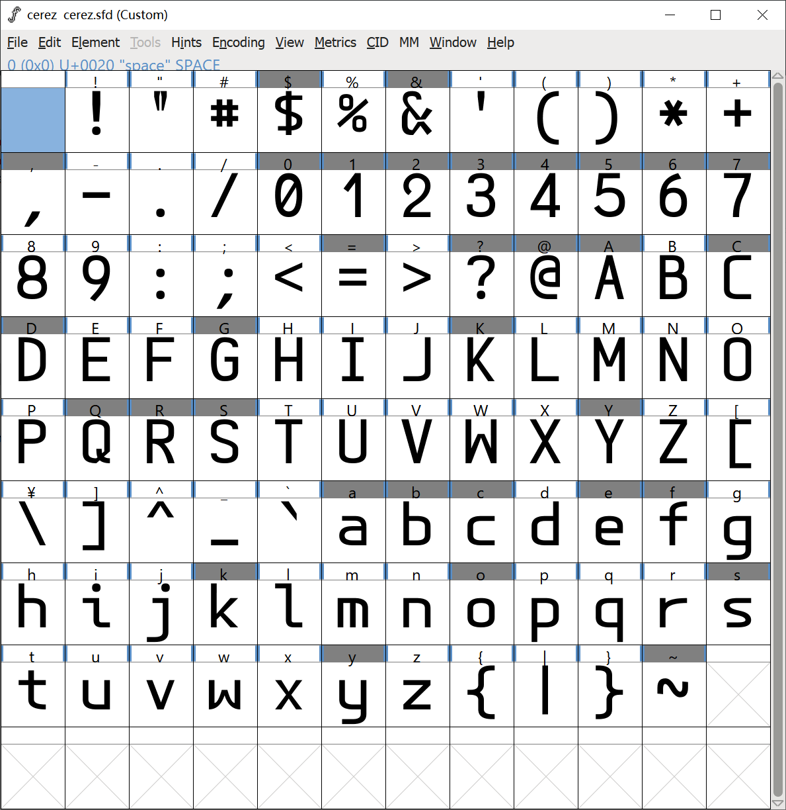

============================================================
Cerez Monospace Font
============================================================

.. meta::
    :keywords: README,Cerez,Cerex,Monospace,Font,等宽字体,字体,编程字体

:Date:      2021-06-08 11:43:41
:From:      NOISNEMID
:Author:    NOISNEMID

CEREZ/CEREX字体下载及全部源代码在如下地址：

https://github.com/noisnemid/cerez_monospace_font

CEREZ系列字体包含两款字体：

-   CEREZ.TTF

    宽高比为6:10的标准版（适用于编程）

-   CEREX.TTF

    宽高比为1:2的X版（适用于标记文本，如rST，Markdown）

    出现英文和CJK字符混排的情况（由于VsCode的上层依赖中字体渲染的遗留问题，当英文字体的宽高比非1:2时，如果同时出现中文字体、韩文字体、日文字体（统称CJK）时，便会出现无法正确对齐的情况，此种情况会对标题标记、表格行列对齐产生严重干扰）。

CEREZ/CEREX等宽字体专为解决其它等宽字体中那些令人抓狂的不完美而设计！

其设计理念为：

-   极简风格，尽量少的细节
-   易混淆字符具有极高的可辨识度
-   无衬线
-   轻度纵横对比度
-   数字高辨识度（风格与字母有细微差异）
-   齐线数字

同时，专门为适配VsCode中CJK字符混排而专门匹配了X版（CEREX，此版本由Python脚本根据比例精确计算后调用FontForge接口生成）。

蓝本
======

最初受Brutal字体启发设计了 CeresLF 字体（最初采用非齐线数字的原始版本），然后压缩比例并对数字进行重绘，调整以及大量其它细节后形成初稿。

1.  比例压缩步骤

通过纵坐标缩放，将原H高宽比 1.854 调整为 1.618，从而避免字符过于瘦长。

缩放结果为：横坐标不变，纵坐标调整为原值之 1.618/1.854= 87.27%。

2.  字符重绘与调整

    #.  ``+ - * < = > ~`` 调到H中心。
    #.  修正小写W中间部分下沿线
    #.  重做问号
    #.  恢复点部件至1:1比例并替换至所有包含此部件的字符。
    #.  微调数字 1,2,3,4,5,7
    #.  区分数字6与9。
    #.  区分数字0与大写字母O的轮廓曲线。
    #.  修正小写字母a

3.  关于自然对比度

在压缩纵坐标时，横坐标并未变化，从而由原来1：1纵横对比度变成了现在的1:0.8727的细微纵横对比度，算是一个额外收获。

纵横对比度的调整是一项见仁见智的事情，特别是在较小尺寸字体时，在屏幕显示上几乎微不可察。

但是仍然是有一些影响。

在低分屏上，会有像素差。

在高分屏特别是视网膜屏幕上，仔细观察仍会有明显区别。

4.  把字框多余的部分去除，保持原字宽高比，即不再刻意保留1：2EM宽高比。

5.  X版字体为通过不动宽高比的情况下调整em框界坐标得来，专门用于1:2配合CJK字符在vscode中使用。

Version 20221005
================

#.  重新设计了大写字母S的风格，以使其更加区分于数字5
#.  进一步明晰了双引号的可辨识性，以使其更加区别于单引号
#.  进一步增加数字3的稳定性
#.  缩减美元符号$的高度
#.  修正大写字母G的左侧弧度，使其更加区分于数字6
#.  修正了数字5的弧度

由于本人精力和水平有限，仅设计了ASCII字符部分，基本上就是全世界所有编程语言使用的全部字符了。此款字体耗费了数百小时的时间进行打磨和测试，因此俺对它的品质是有信心的！

ENJOY IT！

; )
